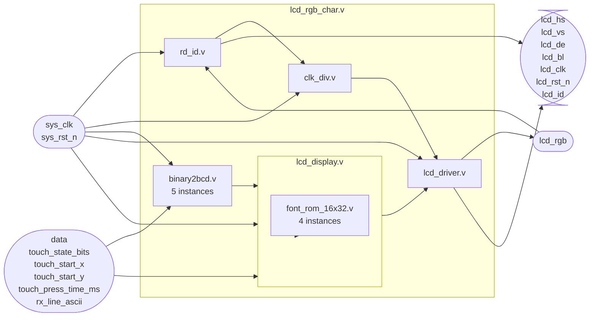
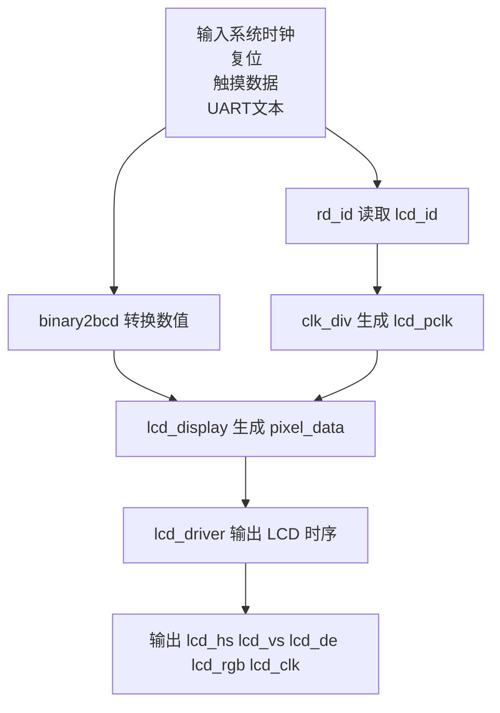
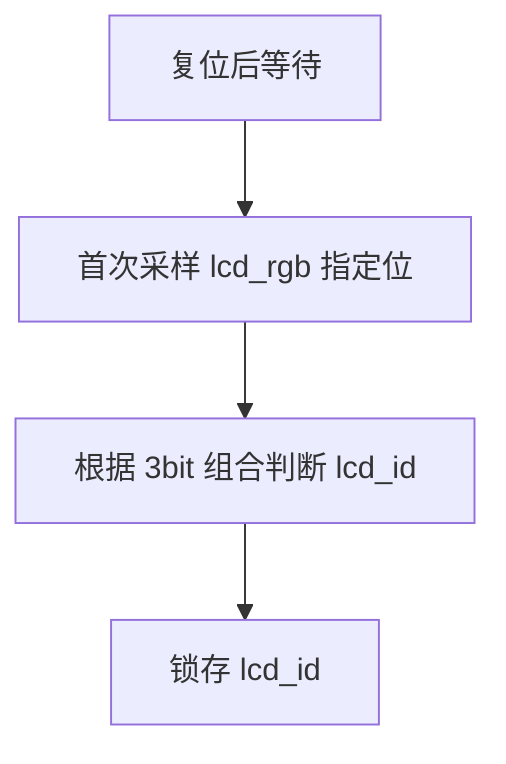
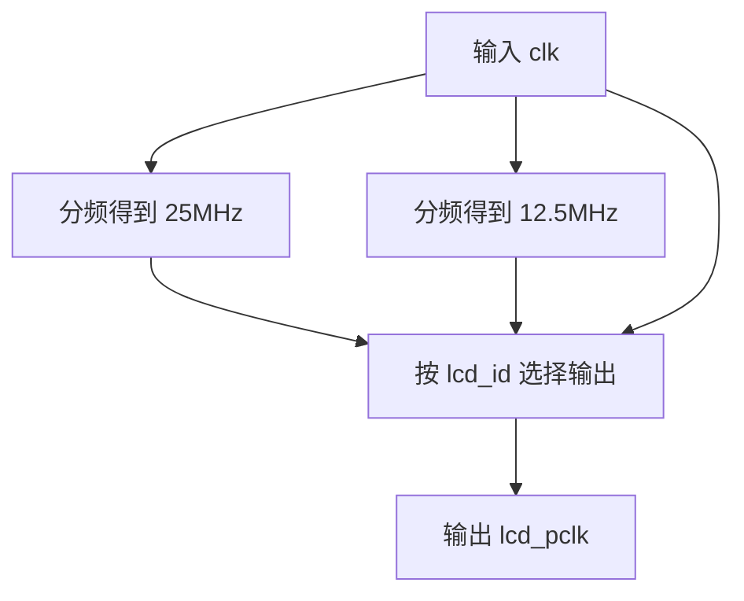
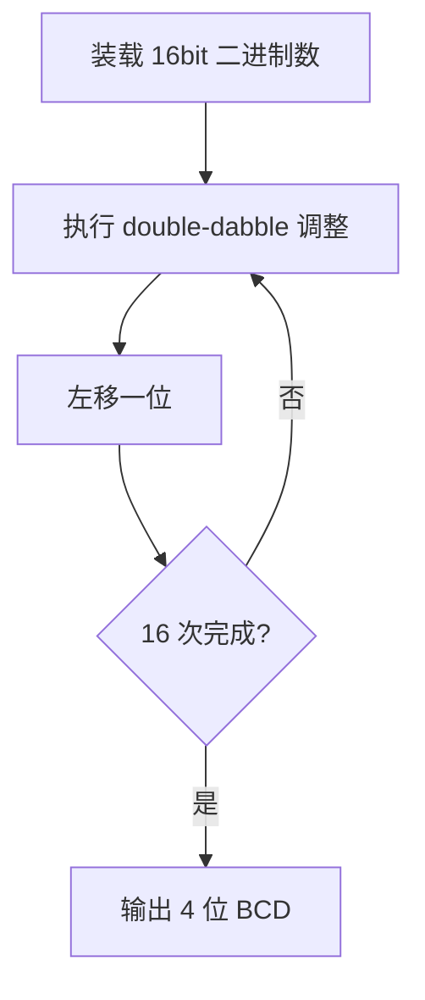
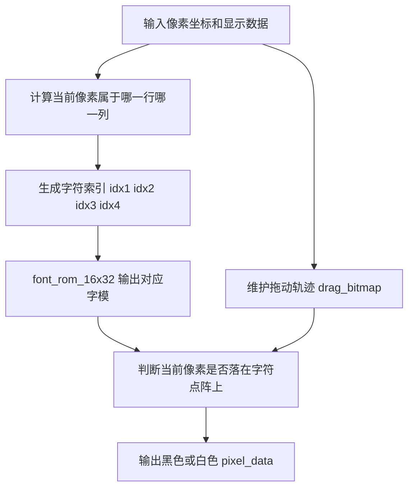
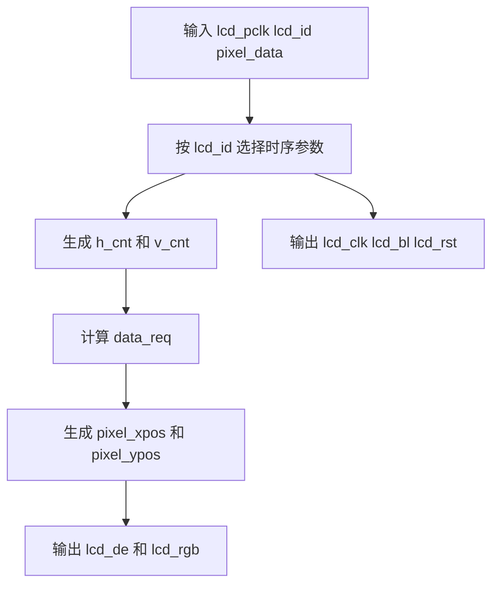
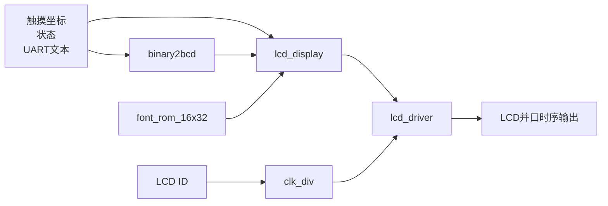

# LCD Display 模块说明

本目录包含 7 个 LCD 显示相关模块：

- `lcd_rgb_char.v`：显示子系统顶层封装
- `rd_id.v`：读取 LCD 面板 ID
- `clk_div.v`：按 LCD ID 选择像素时钟
- `binary2bcd.v`：二进制转 BCD
- `lcd_display.v`：字符/触摸信息渲染
- `font_rom_16x32.v`：16x32 字模 ROM
- `lcd_driver.v`：LCD 时序驱动

整体功能是：读取 LCD 面板 ID，生成匹配的像素时钟，把触摸坐标、状态和 UART 文本组织成字符图像，再输出为 LCD 并口时序信号。

## 1. 模块连接关系

简短说明：

- `lcd_rgb_char.v` 是本目录真正对上层提供接口的顶层模块。
- `rd_id.v` 先从 `lcd_rgb` 复用总线上读出面板 ID。
- `clk_div.v` 根据 `lcd_id` 生成合适的 `lcd_pclk`。
- `binary2bcd.v` 把坐标和时间数据转为 BCD，便于字符显示。
- `lcd_display.v` 根据像素坐标输出当前像素颜色。
- `font_rom_16x32.v` 为 `lcd_display.v` 提供字模数据。
- `lcd_driver.v` 负责产生像素扫描坐标和 LCD 输出时序。

## 2. lcd_rgb_char.v

### 功能

`lcd_rgb_char.v` 是显示子系统顶层封装模块，负责把 ID 读取、时钟分频、数值格式转换、字符渲染和 LCD 时序驱动串接起来。

### 输入输出

| 端口 | 方向 | 位宽 | 说明 |
| --- | --- | --- | --- |
| `sys_clk` | 输入 | 1 | 系统时钟 |
| `sys_rst_n` | 输入 | 1 | 低有效复位 |
| `data` | 输入 | 32 | 触摸坐标数据，`[31:16]` 为 X，`[15:0]` 为 Y |
| `touch_state_bits` | 输入 | 5 | 触摸状态位 |
| `touch_start_x` | 输入 | 16 | 触摸起始 X |
| `touch_start_y` | 输入 | 16 | 触摸起始 Y |
| `touch_press_time_ms` | 输入 | 16 | 按压时间 |
| `rx_line_ascii` | 输入 | 128 | UART 接收 ASCII 文本，16 字符 |
| `lcd_hs` | 输出 | 1 | LCD 行同步 |
| `lcd_vs` | 输出 | 1 | LCD 场同步 |
| `lcd_de` | 输出 | 1 | LCD 数据使能 |
| `lcd_rgb` | 双向 | 24 | LCD RGB 总线/读 ID 复用总线 |
| `lcd_bl` | 输出 | 1 | LCD 背光 |
| `lcd_clk` | 输出 | 1 | LCD 像素时钟 |
| `lcd_rst_n` | 输出 | 1 | LCD 复位 |
| `lcd_id` | 输出 | 16 | 识别出的面板 ID |

### 内部连接

- `rd_id.v`：读取 `lcd_id`
- `clk_div.v`：根据 `lcd_id` 生成 `lcd_pclk`
- `binary2bcd.v`：共实例化 5 次，分别处理 `X`、`Y`、`start_x`、`start_y`、`press_time`
- `lcd_display.v`：生成像素数据 `pixel_data`
- `lcd_driver.v`：输出 LCD 时序与 RGB 数据

### 流程图

## 3. rd_id.v

### 功能

`rd_id.v` 用于在复位释放后读取一次 LCD 面板 ID，并把 ID 锁存到 `lcd_id`。

### 输入输出

| 端口 | 方向 | 位宽 | 说明 |
| --- | --- | --- | --- |
| `clk` | 输入 | 1 | 系统时钟 |
| `rst_n` | 输入 | 1 | 低有效复位 |
| `lcd_rgb` | 输入 | 24 | 复用的 LCD RGB 总线 |
| `lcd_id` | 输出 | 16 | 面板 ID |

### 简短流程

## 4. clk_div.v

### 功能

`clk_div.v` 用于从系统时钟派生 `25MHz` 和 `12.5MHz`，并根据 `lcd_id` 选择输出最终的 `lcd_pclk`。

### 输入输出

| 端口 | 方向 | 位宽 | 说明 |
| --- | --- | --- | --- |
| `clk` | 输入 | 1 | 系统时钟 |
| `rst_n` | 输入 | 1 | 低有效复位 |
| `lcd_id` | 输入 | 16 | 面板 ID |
| `lcd_pclk` | 输出 | 1 | 像素时钟 |

### 简短流程

## 5. binary2bcd.v

### 功能

`binary2bcd.v` 将 16 位二进制数转换为 4 位 BCD，用于在屏幕上显示十进制坐标和时间。

### 输入输出

| 端口 | 方向 | 位宽 | 说明 |
| --- | --- | --- | --- |
| `sys_clk` | 输入 | 1 | 系统时钟 |
| `sys_rst_n` | 输入 | 1 | 低有效复位 |
| `data` | 输入 | 16 | 二进制输入 |
| `bcd_data` | 输出 | 16 | 4 个 BCD 数字 |

### 简短流程

## 6. lcd_display.v

### 功能

`lcd_display.v` 根据当前像素坐标，渲染 4 行字符信息和拖动轨迹，输出单个像素颜色。

显示内容包括：

- 第 1 行：当前触摸坐标 `X/Y`
- 第 2 行：当前触摸状态
- 第 3 行：拖动起点坐标或按压时间
- 第 4 行：UART 接收文本
- 背景：拖动轨迹点阵

### 输入输出

| 端口 | 方向 | 位宽 | 说明 |
| --- | --- | --- | --- |
| `lcd_pclk` | 输入 | 1 | 像素时钟 |
| `sys_rst_n` | 输入 | 1 | 低有效复位 |
| `data` | 输入 | 32 | 当前坐标的 BCD 组合数据 |
| `touch_x` | 输入 | 16 | 原始触摸 X |
| `touch_y` | 输入 | 16 | 原始触摸 Y |
| `touch_state_bits` | 输入 | 5 | 触摸状态位 |
| `start_x_bcd` | 输入 | 16 | 起点 X 的 BCD |
| `start_y_bcd` | 输入 | 16 | 起点 Y 的 BCD |
| `press_time_bcd` | 输入 | 16 | 按压时间 BCD |
| `rx_line_ascii` | 输入 | 128 | UART ASCII 文本 |
| `pixel_xpos` | 输入 | 11 | 当前像素 X |
| `pixel_ypos` | 输入 | 11 | 当前像素 Y |
| `pixel_data` | 输出 | 24 | 当前像素 RGB |

### 内部关系

- 内含 4 个 `font_rom_16x32.v` 实例，分别用于 4 行字符的字模读取。
- 把 ASCII 文本转成字库索引后，再逐像素读取字模。
- 用 `drag_bitmap` 记录拖动轨迹并优先显示为黑色像素。

### 流程图

## 7. font_rom_16x32.v

### 功能

`font_rom_16x32.v` 是字模查找表模块，输入字符索引，输出对应的 `16x32` 字形点阵。

### 输入输出

| 端口 | 方向 | 位宽 | 说明 |
| --- | --- | --- | --- |
| `char_idx` | 输入 | 7 | 字符索引 |
| `glyph` | 输出 | 512 | 16x32 字模数据 |

### 简短说明

- 本模块是纯组合查表结构。
- `lcd_display.v` 中会并行实例化 4 个 `font_rom_16x32.v`，分别服务 4 行字符渲染。

## 8. lcd_driver.v

### 功能

`lcd_driver.v` 根据 `lcd_id` 选择面板时序参数，生成扫描计数器、像素坐标、数据请求信号以及最终 LCD 输出信号。

### 输入输出

| 端口 | 方向 | 位宽 | 说明 |
| --- | --- | --- | --- |
| `lcd_pclk` | 输入 | 1 | 像素时钟 |
| `rst_n` | 输入 | 1 | 低有效复位 |
| `lcd_id` | 输入 | 16 | 面板 ID |
| `pixel_data` | 输入 | 24 | 上游生成的像素数据 |
| `pixel_xpos` | 输出 | 11 | 当前像素 X |
| `pixel_ypos` | 输出 | 11 | 当前像素 Y |
| `h_disp` | 输出 | 11 | 水平显示宽度 |
| `v_disp` | 输出 | 11 | 垂直显示高度 |
| `data_req` | 输出 | 1 | 像素数据请求 |
| `lcd_de` | 输出 | 1 | 数据使能 |
| `lcd_hs` | 输出 | 1 | 行同步 |
| `lcd_vs` | 输出 | 1 | 场同步 |
| `lcd_bl` | 输出 | 1 | 背光控制 |
| `lcd_clk` | 输出 | 1 | LCD 时钟 |
| `lcd_rst` | 输出 | 1 | LCD 复位 |
| `lcd_rgb` | 输出 | 24 | LCD RGB 数据 |

### 流程图

## 9. 整体数据流

简短总结：

- `lcd_rgb_char.v` 负责把多个显示相关子模块拼成完整显示链路。
- `rd_id.v` 和 `clk_div.v` 决定当前面板及其像素时钟。
- `binary2bcd.v` 负责把数值变成适合文本显示的格式。
- `lcd_display.v` 和 `font_rom_16x32.v` 负责“画什么”。
- `lcd_driver.v` 负责“按什么时序送到屏上”。
