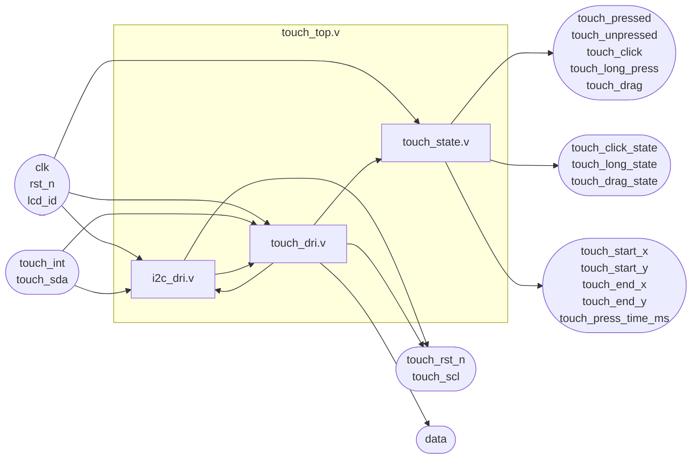
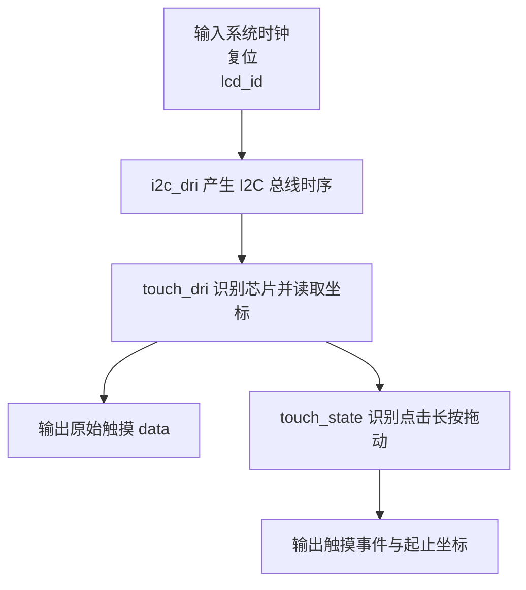
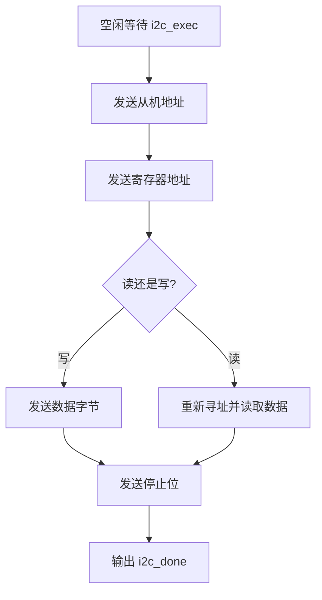
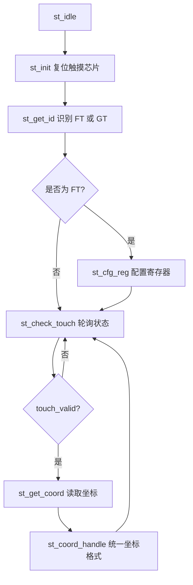
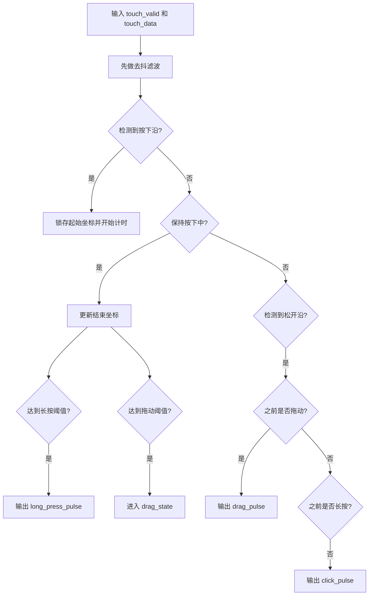
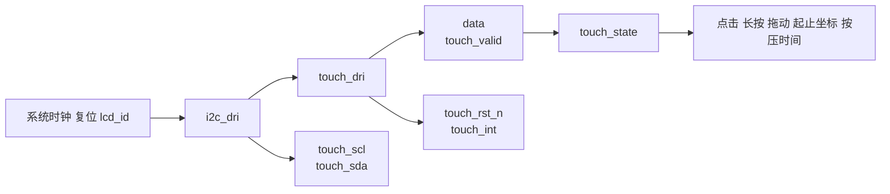

# LCD Touch 模块说明

本目录包含 4 个触摸相关模块：

- `touch_top.v`：触摸子系统顶层封装
- `i2c_dri.v`：I2C 位级事务引擎
- `touch_dri.v`：触摸协议状态机
- `touch_state.v`：触摸事件与手势判定

整体功能是：通过 I2C 与触摸芯片通信，完成复位、芯片识别、触摸状态轮询和坐标读取，再进一步输出点击、长按、拖动等高层触摸事件。

## 1. 模块连接关系

简短说明：

- `touch_top.v` 是触摸子系统对上层提供的统一接口。
- `i2c_dri.v` 只负责 I2C 总线级读写，不理解触摸芯片协议。
- `touch_dri.v` 负责具体触摸芯片初始化、轮询和坐标读取。
- `touch_state.v` 负责把原始坐标和 `touch_valid` 转换为点击、长按、拖动等事件。

## 2. touch_top.v

### 功能

`touch_top.v` 是触摸子系统顶层模块，负责连接底层 I2C 驱动、触摸协议状态机和触摸事件状态机，并对外输出统一的触摸数据和事件信号。

### 输入输出

| 端口 | 方向 | 位宽 | 说明 |
| --- | --- | --- | --- |
| `clk` | 输入 | 1 | 系统时钟 |
| `rst_n` | 输入 | 1 | 低有效复位 |
| `touch_rst_n` | 输出 | 1 | 触摸芯片复位 |
| `touch_int` | 双向 | 1 | 触摸中断/握手引脚 |
| `touch_scl` | 输出 | 1 | I2C 时钟 |
| `touch_sda` | 双向 | 1 | I2C 数据 |
| `lcd_id` | 输入 | 16 | LCD ID，用于辅助判断触摸芯片类型 |
| `data` | 输出 | 32 | 原始触摸坐标，`{x,y}` |
| `touch_pressed` | 输出 | 1 | 按下状态 |
| `touch_unpressed` | 输出 | 1 | 松开状态 |
| `touch_click` | 输出 | 1 | 点击脉冲 |
| `touch_long_press` | 输出 | 1 | 长按脉冲 |
| `touch_drag` | 输出 | 1 | 拖动脉冲 |
| `touch_click_state` | 输出 | 1 | 点击状态 |
| `touch_long_state` | 输出 | 1 | 长按状态 |
| `touch_drag_state` | 输出 | 1 | 拖动状态 |
| `touch_start_x` | 输出 | 16 | 起始 X |
| `touch_start_y` | 输出 | 16 | 起始 Y |
| `touch_end_x` | 输出 | 16 | 结束 X |
| `touch_end_y` | 输出 | 16 | 结束 Y |
| `touch_press_time_ms` | 输出 | 16 | 按压时间 |

### 内部连接

- `i2c_dri.v` 提供底层 I2C 事务能力
- `touch_dri.v` 通过 `i2c_dri.v` 读写触摸芯片寄存器，输出 `data` 和 `touch_valid`
- `touch_state.v` 基于 `data` 和 `touch_valid` 生成高层事件输出

### 流程图

## 3. i2c_dri.v

### 功能

`i2c_dri.v` 是底层 I2C 位级事务引擎，支持：

- 7 位从机地址
- 8/16 位寄存器地址
- 读写访问
- 多字节寄存器读写

它只负责执行 I2C 总线操作，不负责理解触摸芯片寄存器含义。

### 输入输出

| 端口 | 方向 | 位宽 | 说明 |
| --- | --- | --- | --- |
| `clk` | 输入 | 1 | 系统时钟 |
| `rst_n` | 输入 | 1 | 低有效复位 |
| `slave_addr` | 输入 | 7 | I2C 从机地址 |
| `i2c_exec` | 输入 | 1 | 事务启动信号 |
| `i2c_rh_wl` | 输入 | 1 | 读写控制 |
| `i2c_addr` | 输入 | 16 | 寄存器地址 |
| `i2c_data_w` | 输入 | 8 | 写入数据 |
| `bit_ctrl` | 输入 | 1 | 地址宽度控制 |
| `reg_num` | 输入 | `WIDTH` | 连续传输字节数 |
| `i2c_data_r` | 输出 | 8 | 读出数据 |
| `i2c_done` | 输出 | 1 | 事务完成 |
| `once_byte_done` | 输出 | 1 | 单字节完成 |
| `scl` | 输出 | 1 | I2C 时钟 |
| `ack` | 输出 | 1 | 应答状态 |
| `sda` | 双向 | 1 | I2C 数据 |
| `dri_clk` | 输出 | 1 | I2C 驱动内部时钟 |

### 主要状态

- `st_idle`
- `st_sladdr`
- `st_addr16`
- `st_addr8`
- `st_data_wr`
- `st_addr_rd`
- `st_data_rd`
- `st_stop`

### 流程图

### 简短说明

- `dri_clk` 是 I2C 驱动内部节拍时钟。
- `once_byte_done` 便于上层协议状态机逐字节接收数据。
- `touch_dri.v` 通过 `slave_addr/i2c_exec/i2c_addr/reg_num` 等信号驱动本模块。

## 4. touch_dri.v

### 功能

`touch_dri.v` 是触摸协议状态机，负责：

- 触摸芯片复位时序
- FT/GT 两类触摸芯片识别
- FT 芯片寄存器初始化
- 周期性轮询触摸状态
- 读取触摸坐标
- 把不同芯片格式的坐标统一整理为 `{x,y}`

### 输入输出

| 端口 | 方向 | 位宽 | 说明 |
| --- | --- | --- | --- |
| `clk` | 输入 | 1 | 驱动时钟，来自 `dri_clk` |
| `rst_n` | 输入 | 1 | 低有效复位 |
| `slave_addr` | 输出 | 7 | I2C 从机地址 |
| `i2c_exec` | 输出 | 1 | 启动 I2C 事务 |
| `i2c_rh_wl` | 输出 | 1 | I2C 读写控制 |
| `i2c_addr` | 输出 | 16 | I2C 寄存器地址 |
| `i2c_data_w` | 输出 | 8 | I2C 写数据 |
| `bit_ctrl` | 输出 | 1 | 地址宽度控制 |
| `reg_num` | 输出 | `WIDTH` | 连续传输字节数 |
| `i2c_data_r` | 输入 | 8 | I2C 读数据 |
| `i2c_ack` | 输入 | 1 | I2C ACK 状态 |
| `i2c_done` | 输入 | 1 | I2C 完成 |
| `once_byte_done` | 输入 | 1 | 单字节完成 |
| `lcd_id` | 输入 | 16 | LCD ID |
| `data` | 输出 | 32 | 原始触摸坐标 `{x,y}` |
| `touch_valid` | 输出 | 1 | 当前是否检测到有效触摸 |
| `touch_rst_n` | 输出 | 1 | 触摸芯片复位 |
| `touch_int` | 双向 | 1 | 触摸中断/握手引脚 |

### 主要状态

- `st_idle`：上电准备
- `st_init`：触摸芯片复位初始化
- `st_get_id`：识别 FT/GT 芯片类型
- `st_cfg_reg`：配置 FT 运行参数
- `st_check_touch`：轮询是否有有效触摸
- `st_get_coord`：读取原始坐标字节
- `st_coord_handle`：统一整理坐标格式

### 流程图

### 简短说明

- 本模块根据 `lcd_id` 和 I2C 读回结果判断当前触摸芯片类型。
- `st_check_touch` 中先读状态寄存器，再清状态位。
- `st_get_coord` 读取 4 个字节的坐标数据。
- `st_coord_handle` 对 FT 和 GT 的寄存器格式做统一处理后输出到 `data`。

## 5. touch_state.v

### 功能

`touch_state.v` 基于 `touch_valid` 和 `touch_data`，输出高层手势事件：

- 按下
- 松开
- 点击
- 长按
- 拖动

同时输出起点、终点和按压时长。

### 输入输出

| 端口 | 方向 | 位宽 | 说明 |
| --- | --- | --- | --- |
| `clk` | 输入 | 1 | 状态处理时钟 |
| `rst_n` | 输入 | 1 | 低有效复位 |
| `touch_valid` | 输入 | 1 | 是否有有效触摸 |
| `touch_data` | 输入 | 32 | 原始坐标 `{x,y}` |
| `pressed` | 输出 | 1 | 按下状态 |
| `unpressed` | 输出 | 1 | 松开状态 |
| `click_pulse` | 输出 | 1 | 点击脉冲 |
| `long_press_pulse` | 输出 | 1 | 长按脉冲 |
| `drag_pulse` | 输出 | 1 | 拖动脉冲 |
| `click_state` | 输出 | 1 | 点击状态 |
| `long_press_state` | 输出 | 1 | 长按状态 |
| `drag_state` | 输出 | 1 | 拖动状态 |
| `start_x` | 输出 | 16 | 起始 X |
| `start_y` | 输出 | 16 | 起始 Y |
| `end_x` | 输出 | 16 | 结束 X |
| `end_y` | 输出 | 16 | 结束 Y |
| `press_time_ms` | 输出 | 16 | 按压时间，毫秒 |

### 关键处理

- 对 `touch_valid` 先做去抖
- 在首次稳定按下时锁存起始坐标
- 按 1ms 计时判断长按
- 按位移阈值判断拖动
- 松手时输出点击或拖动脉冲

### 流程图

## 6. 整体数据流

简短总结：

- `i2c_dri.v` 负责“怎么在 I2C 总线上读写”。
- `touch_dri.v` 负责“读哪些寄存器、怎样得到坐标”。
- `touch_state.v` 负责“怎样把坐标变化解释成点击、长按、拖动”。
- `touch_top.v` 负责把整套触摸链路封装成统一接口给上层使用。
