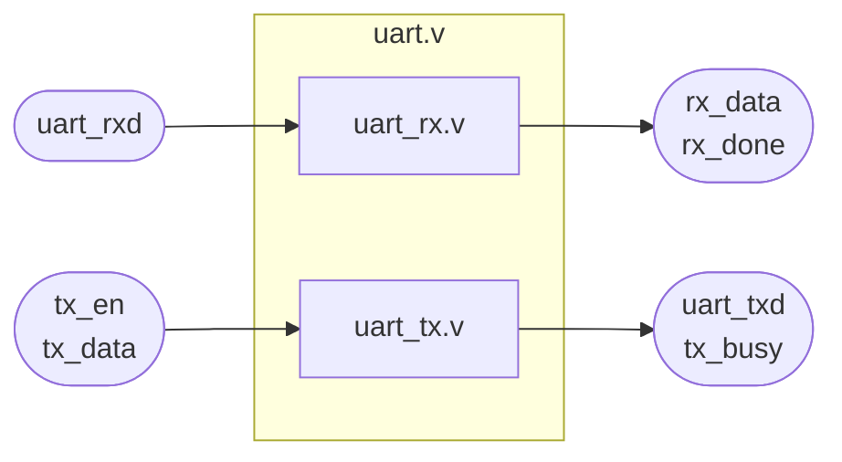
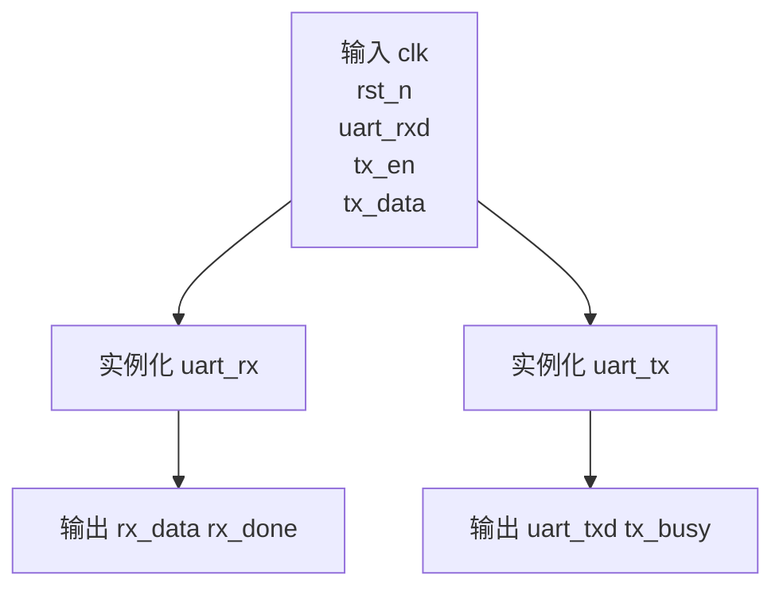
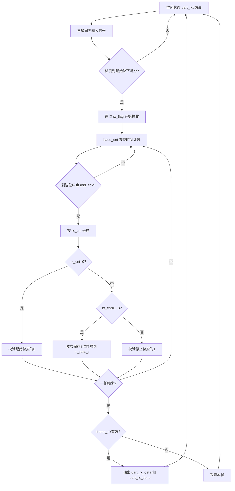
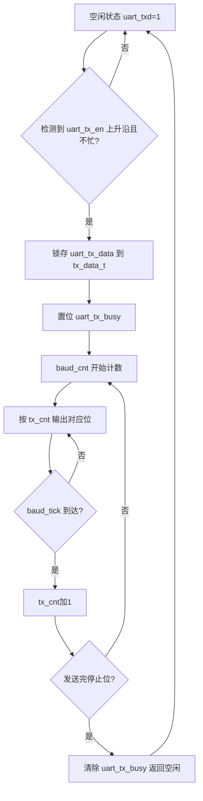
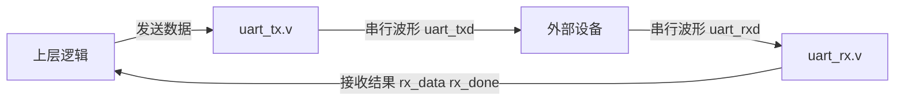

# UART 模块说明

本目录包含 3 个 UART 相关模块：

- `uart.v`：顶层封装模块
- `uart_rx.v`：串口接收模块
- `uart_tx.v`：串口发送模块

默认协议为 `8N1`：

- 1 位起始位，低电平
- 8 位数据位，低位先发
- 1 位停止位，高电平
- 无校验位

## 1. 模块连接关系

简短说明：

- `uart.v` 不做收发协议处理，只负责把 `uart_rx` 和 `uart_tx` 封装到一起。
- `uart_rx.v` 负责从 `uart_rxd` 上接收 1 字节数据，并在接收完成后输出 `rx_done` 脉冲。
- `uart_tx.v` 负责把上层给出的 1 字节数据按 UART 时序从 `uart_txd` 发出去，并在发送期间拉高 `tx_busy`。

## 2. uart.v

### 功能

`uart.v` 是顶层封装模块，用统一接口对外提供 UART 收发功能。

### 输入输出

| 端口 | 方向 | 位宽 | 说明 |
| --- | --- | --- | --- |
| `clk` | 输入 | 1 | 系统时钟 |
| `rst_n` | 输入 | 1 | 低有效复位 |
| `uart_rxd` | 输入 | 1 | UART 串行接收输入 |
| `uart_txd` | 输出 | 1 | UART 串行发送输出 |
| `tx_en` | 输入 | 1 | 发送触发信号 |
| `tx_data` | 输入 | 8 | 要发送的 1 字节数据 |
| `tx_busy` | 输出 | 1 | 发送忙标志 |
| `rx_data` | 输出 | 8 | 接收到的 1 字节数据 |
| `rx_done` | 输出 | 1 | 接收完成脉冲 |

### 内部连接

- `uart_rxd -> uart_rx.v`
- `uart_rx.v` 输出 `uart_rx_data/uart_rx_done -> rx_data/rx_done`
- `tx_en/tx_data -> uart_tx.v`
- `uart_tx.v` 输出 `uart_txd/uart_tx_busy -> uart_txd/tx_busy`

### 流程图

## 3. uart_rx.v

### 功能

`uart_rx.v` 用于接收 UART 串口数据，完成以下动作：

- 对 `uart_rxd` 做三级寄存器同步
- 检测起始位下降沿
- 按波特率计数，在每一位的中点采样
- 接收 8 位数据
- 校验起始位和停止位
- 输出 `uart_rx_data` 和 `uart_rx_done`

### 输入输出

| 端口 | 方向 | 位宽 | 说明 |
| --- | --- | --- | --- |
| `clk` | 输入 | 1 | 系统时钟 |
| `rst_n` | 输入 | 1 | 低有效复位 |
| `uart_rxd` | 输入 | 1 | UART 串行输入，空闲为高 |
| `uart_rx_data` | 输出 | 8 | 接收到的 1 字节数据 |
| `uart_rx_done` | 输出 | 1 | 接收完成脉冲 |

### 核心寄存器/信号

| 名称 | 作用 |
| --- | --- |
| `uart_rxd_d0/d1/d2` | 对异步串口输入做三级同步 |
| `start_edge` | 检测起始位下降沿 |
| `rx_flag` | 接收进行中标志 |
| `baud_cnt` | 波特率计数器 |
| `mid_tick` | 位中点采样时刻 |
| `rx_cnt` | 当前接收到第几位，`0` 表示起始位，`1~8` 表示数据位，`9` 表示停止位 |
| `rx_data_t` | 临时接收数据寄存器 |
| `frame_ok` | 帧有效标志，用于检查起始位和停止位 |

### 接收流程

### 简短说明

- 模块在 `start_edge` 出现后开始接收。
- 每一位只在中点采样一次，降低边沿附近误采样的概率。
- 只有起始位正确且停止位为高时，才输出 `uart_rx_done=1`。

## 4. uart_tx.v

### 功能

`uart_tx.v` 用于发送 UART 串口数据，完成以下动作：

- 对 `uart_tx_en` 做沿检测
- 在空闲时锁存待发送字节
- 按波特率逐位发送起始位、8 位数据位和停止位
- 发送期间输出 `uart_tx_busy`

### 输入输出

| 端口 | 方向 | 位宽 | 说明 |
| --- | --- | --- | --- |
| `clk` | 输入 | 1 | 系统时钟 |
| `rst_n` | 输入 | 1 | 低有效复位 |
| `uart_tx_en` | 输入 | 1 | 发送触发脉冲 |
| `uart_tx_data` | 输入 | 8 | 待发送的 1 字节数据 |
| `uart_txd` | 输出 | 1 | UART 串行输出，空闲为高 |
| `uart_tx_busy` | 输出 | 1 | 发送忙标志 |

### 核心寄存器/信号

| 名称 | 作用 |
| --- | --- |
| `uart_tx_en_d0` | 对发送使能打一拍，用于上升沿检测 |
| `tx_start` | 发送启动信号，仅在空闲时有效 |
| `baud_cnt` | 波特率计数器 |
| `baud_tick` | 一个比特发送时间结束标志 |
| `tx_cnt` | 当前发送到第几位，`0` 为起始位，`1~8` 为数据位，`9` 为停止位 |
| `tx_data_t` | 锁存的待发送字节 |

### 发送流程

### 位发送顺序

| `tx_cnt` | 发送内容 |
| --- | --- |
| `0` | 起始位 `0` |
| `1` | `tx_data_t[0]` |
| `2` | `tx_data_t[1]` |
| `3` | `tx_data_t[2]` |
| `4` | `tx_data_t[3]` |
| `5` | `tx_data_t[4]` |
| `6` | `tx_data_t[5]` |
| `7` | `tx_data_t[6]` |
| `8` | `tx_data_t[7]` |
| `9` | 停止位 `1` |

### 简短说明

- `uart_tx_en` 必须是触发脉冲，且发送时机要避开 `uart_tx_busy=1`。
- 模块只发送 1 字节；如果要连续发送多字节，需要上层状态机逐字节喂入。

## 5. 收发模块协同关系

简短总结：

- `uart_tx.v` 解决“并行 8 位数据如何按 UART 时序发出去”。
- `uart_rx.v` 解决“UART 串行波形如何恢复成 8 位并行数据”。
- `uart.v` 解决“给上层一个统一的收发接口”。
